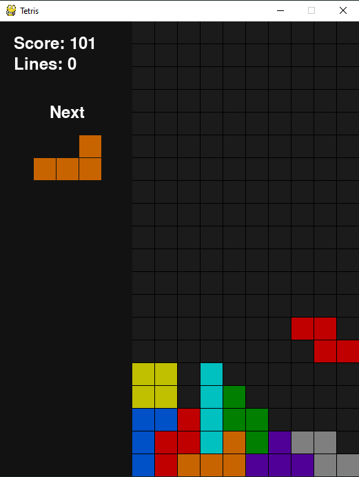

# Tetris

A reconstruction of the famous game Tetris using Python and Pygame.

**Controls**

Use the LEFT and RIGHT arrow keys to move the piece horizonally, the DOWN key to move it down more quickly, the SPACE key to drop the piece to the floor, and UP or Z to rotate the piece right or left respectively.